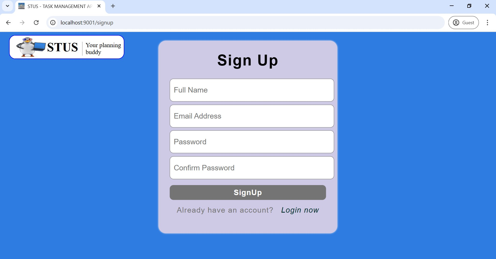

# **STUS App** 

**Stus** project focus on delivering a digital work space that meets the essential needs of user's while managing tasks, organize tasks, and tracking progress.
It's a user-friendly task management application built with React. This app allows users to create, edit, delete, and organize tasks efficiently, helping to boost productivity and manage time effectively.

The name **STUS** is derived from the initial of the first name of all collaborators.

## **CORE FEATURES**
 
 1. **User Authenthications**
    - Basic signup/login  functionality using email and password. 
    - Password **must** be at least 8 characters long and include:
       - An uppercase letter
       - A lowercase letter
       - A digit
       - A special character
  
2. **Task Creation and Management**
   - Create tasks with a title and description.
   - Set due dates for tasks.
   - Mark tasks as completed or pending.

3. **Task List View**
   - Display tasks grouped by their status, e.g. "Pending" and "Completed."

4. **Notifications**
   - Simple reminders for tasks with due dates

---
## **Tech Stack**

### **Frontend**
- [React.js](https://reactjs.org/)  
- [Webpack](https://webpack.js.org/)  
- [Babel](https://babeljs.io/)  
- HTML  
- CSS  
- [Aphrodite](https://github.com/Khan/aphrodite) (CSS-in-JS styling library)  
- Canva (for design and mockups)


### **Backend**
- [Firebase](https://firebase.google.com/) (Authentication and Data Storage)

---

## **Installation and Setup**

To get the app running locally, follow these steps:

1. **Clone the repository**  
   ```bash
   git clone https://github.com/sm202020/Webstack-Portfolio-Project
   ```

2. **Navigate to the project directory**
 ```bash
 cd  Webstack-Portfolio-Project/stus/dashboard
 ```
 
3. **Install Node.js version 21 and project dependenciess**
 ```bash
    nvm install 21
    npm install
```

4. **Start the development server**
  ```bash
  npm run start
  ```
5. **Access the app**
The app will be available at **(http://localhost:9001)** on a web broswer. 

## **DEMO**




## **CONTRIBUTORS**
A special thanks to the team that made this project possible:
- Smith Mebawondu - [email](akinbode4life@gmail.com) [github](https://github.com/sm202020)
- Ojewande Taofeek - [email](taofeekojewande@nda.edu.ng) [github](https://github.com/ojewande-taofeek)
- Naja'atu Umar Atiku- [email](najaatiku1@gmail.com) [github](https://github.com/Atikunaja)
- Agbo Samson Udochukwu - [email](agbo4samson@gmail.com) [github](https://github.com/Udoozy)

## **LICENSE**
This project is licensed under the MIT License. See the LICENSE file for details.
